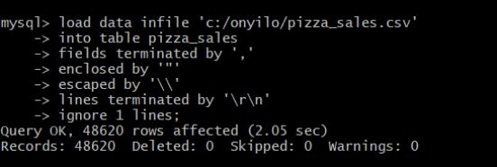

### Pizza_Sales

# Data Description
The data contains insights about a pizza sale of a company. The data has `12` columns with `48621` rows. In this project, I analyzed the key indicators for the pizza sales data to gain insight into the business performance. I used both MYSQL and Power BI for the analysis. Here are the columns in pizza sales dataset:
* **pizza_id** – The unique id for each pizza the pizza sales
* **order_id** – The unique id for orders	
* **pizza_name_id** – The unique id for the pizza name or type
* **quantity** – The quantity sold
* **order_date** – The order date for the pizza sold
* **order_time** – The order time for the pizza sold
* **unit_price** – The unit price for the pizza
* **total_price** – The total price sold
* **pizza_size** – The size of pizza
* **pizza_category** – The category the pizza belong to eg classic, supreme etc
* **pizza_ingredients** – Ingredients used for the pizza
* **pizza_name** – The name of the pizza.

# Data Preparation for Power BI.
I created 6 (six) new columns 
* **Day Name** – Extracted day name (Friday, Monday etc) from order date
* **Order Day** – extracted the first three letters from day name and converted it to uppercase
* **Day No** – I used a conditional column to create this column eg Sunday = 1, Monday = 2, etc
* **Month Name** – Got this by extracting the month name (January, February etc.) from order date
* **Month Number** – Used the features in power to extract the month number
* **Order Month** – Got the first three letters from the month name.
# DAX Formula
* **Average_Order** = *[Total Revenue] / [Total_Order]*
* **Avg_Pizza_Per_Order** = *'pizza_db pizza_sales'[Pizza_Sold] / [Total_Order]*
* **Pizza_Sold** = *SUM('pizza_db pizza_sales'[quantity])*
* **Total Revenue** = *SUM('pizza_db pizza_sales'[total_price])*
* **Total_Order** = *DISTINCTCOUNT('pizza_db pizza_sales'[order_id])*

# Data Import in MySQL
To import the dataset (csv file) into MySQL. I used the load data infile method to import my data into MySQL, this is because the dataset was taking centuries to import via the import wizard in MySQL. I used the following code below
 and this to create the database and table in MySQL workbench

# Business Insights (Problem Statement)
* Total Revenue
* Average Order Value
* Total Pizza Sold
* Average Pizzas per Order
* Daily Trends for Total Order
* Monthly Trends for Total Order
* Percentage of Orders per Pizza Category
* Percentage of sales by pizza size
* Total pizza sold by pizza category
* Top 5 best sellers by revenue, total quantity and total order
* Bottom 5 best sellers by revenue, total quantity and total order
* 
